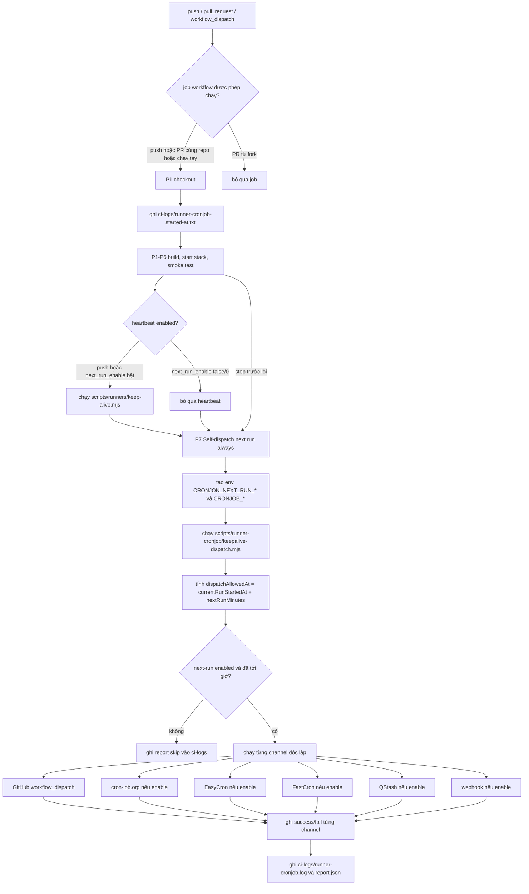

# Deploy Runner Cronjob

`scripts/runner-cronjob` giữ chuỗi CI không bị tắt hẳn:

1. Workflow gọi `keepalive-dispatch.mjs --mark-start` để ghi thời điểm bắt đầu
   vào `ci-logs/runner-cronjob-started-at.txt`.
2. Run hiện tại giữ stack sống bằng `scripts/runners/keep-alive.mjs`.
3. Step riêng `P7 Self-dispatch next run` luôn chạy với `always()`, kể cả khi
   build/smoke test trước đó lỗi.
4. Script tính `startedAt + CRONJON_NEXT_RUN_MINUTES`.
5. Nếu đã tới mốc và `CRONJON_NEXT_RUN_ENABLE` bật, script gọi GitHub
   `workflow_dispatch` và các channel ngoài nào có cấu hình.
6. Log chi tiết ghi vào `ci-logs/runner-cronjob.log` và
   `ci-logs/runner-cronjob-report.json`, rồi được upload cùng artifact CI.

## GitHub Actions

Workflow cần quyền:

```yaml
permissions:
  actions: write
```

Các input đã được nối trong `.github/workflows/test.yml`:

```text
run_group
next_run_enable
next_run_minutes
```

`concurrency.group` dùng:

```text
github.event.inputs.run_group || "<github.workflow>-<github.ref_name>"
```

Giá trị này đi vào `CRONJOB_RUN_GROUP`, rồi đi tiếp vào
`workflow_dispatch.inputs.run_group` của run kế tiếp. Đây là khóa chống trùng
cho toàn bộ chuỗi.

## Sơ Đồ Hoạt Động



## Env Từ Workflow Vào Script

| Env | Nguồn | Tác dụng |
| --- | --- | --- |
| `CRONJON_NEXT_RUN_ENABLE` | input/vars, default `true` | bật/tắt dispatch run kế tiếp |
| `CRONJON_NEXT_RUN_MINUTES` | input/vars, default `58` | số phút dự kiến của 1 workflow |
| `GITHUB_TOKEN` | `${{ github.token }}` | token self-dispatch trên GitHub |
| `CRONJOB_RUN_GROUP` | input hoặc workflow/ref default | concurrency group truyền sang run kế tiếp |
| `CRONJOB_DISPATCH_PAT` | secret | PAT cho channel ngoài gọi GitHub |
| `CRONJOB_*_ENABLE` | vars, optional | bật/tắt từng channel ngoài |
| token/API key từng channel | secrets | xác thực với dịch vụ ngoài |
| lịch từng channel | vars | lịch chạy của dịch vụ ngoài |

`CRONJON_NEXT_RUN_ENABLE` nhận `true/false/1/0/yes/no/on/off`. Nếu không set
hoặc rỗng thì mặc định là bật.

## Xử Lý Trong Script

`keepalive-dispatch.mjs` chạy theo thứ tự:

1. Parse `--dry-run` và `--silent`.
2. Load `keepalive-dispatch-config.jsonc`; nếu file mất, dùng default trong code.
3. Detect CI provider bằng `ci-provider.mjs`.
4. Tính plan:
   - `currentRunStartedAt` từ `ci-logs/runner-cronjob-started-at.txt`, file này
     được tạo bởi `keepalive-dispatch.mjs --mark-start`
   - `nextRunMinutes` từ `CRONJON_NEXT_RUN_MINUTES`, default `58`
   - `dispatchAllowedAt = currentRunStartedAt + nextRunMinutes`
   - `allowedNow = now >= dispatchAllowedAt`
5. Nếu `CRONJON_NEXT_RUN_ENABLE=false/0/no/off`, log skip và ghi report.
6. Nếu chưa tới `dispatchAllowedAt`, log skip và ghi report.
7. Nếu được phép, chạy từng channel độc lập. Channel có token/API env sẽ chạy;
   đặt `CRONJOB_<CHANNEL>_ENABLE=false` hoặc `0` để tắt hẳn. Channel này lỗi không chặn channel
   khác.
8. Ghi summary:
   - flow bắt đầu lúc nào
   - mốc cho phép dispatch là lúc nào
   - next-run bật/tắt dựa vào env nào
   - channel nào được cấu hình
   - response từng API
   - tổng success/fail/skipped
9. Ghi log vào `ci-logs/runner-cronjob.log` và JSON report vào
   `ci-logs/runner-cronjob-report.json`.

## Body Dispatch

```json
{
  "ref": "main",
  "inputs": {
    "run_group": "stack-test-main",
    "next_run_enable": "true",
    "next_run_minutes": "58"
  }
}
```

## Xử Lý Theo Channel

GitHub self-dispatch:

- luôn được thử khi next-run bật và đã tới mốc
- token: `CRONJOB_GITHUB_TOKEN`, nếu thiếu dùng `GITHUB_TOKEN`
- request: `POST /repos/{owner}/{repo}/actions/workflows/{workflow}/dispatches`

cron-job.org:

- chạy khi có `CRONJOB_CRONJOBORG_API_KEY`, trừ khi `CRONJOB_CRONJOBORG_ENABLE=false/0`
- cần `CRONJOB_CRONJOBORG_API_KEY` và `CRONJOB_DISPATCH_PAT`

EasyCron:

- chạy khi có `CRONJOB_EASYCRON_API_KEY`, trừ khi `CRONJOB_EASYCRON_ENABLE=false/0`
- cần `CRONJOB_EASYCRON_API_KEY` và `CRONJOB_DISPATCH_PAT`

FastCron:

- chạy khi có `CRONJOB_FASTCRON_TOKEN`, trừ khi `CRONJOB_FASTCRON_ENABLE=false/0`
- cần `CRONJOB_FASTCRON_TOKEN` và `CRONJOB_DISPATCH_PAT`

Upstash QStash:

- chạy khi có `CRONJOB_QSTASH_TOKEN`, trừ khi `CRONJOB_QSTASH_ENABLE=false/0`
- cần `CRONJOB_QSTASH_TOKEN` và `CRONJOB_DISPATCH_PAT`

Generic webhook:

- chạy khi có `CRONJOB_WEBHOOK_URL`, trừ khi `CRONJOB_WEBHOOK_ENABLE=false/0`
- cần `CRONJOB_WEBHOOK_URL`

## Env Tối Thiểu

```env
CRONJON_NEXT_RUN_ENABLE=true
CRONJON_NEXT_RUN_MINUTES=58
```

Dự phòng bằng cron-job.org:

```env
CRONJON_NEXT_RUN_ENABLE=true
CRONJON_NEXT_RUN_MINUTES=58
CRONJOB_DISPATCH_PAT=github_pat_xxx
CRONJOB_CRONJOBORG_ENABLE=true
CRONJOB_CRONJOBORG_API_KEY=xxx
CRONJOB_CRONJOBORG_MINUTE=0
```

## Rule Thêm API Channel Mới

1. Thêm docs `<channel>.api.md` trong `scripts/runner-cronjob/`, có link API,
   ngày cập nhật, endpoint, auth, env và ví dụ payload.
2. Thêm env vào `scripts/runner-cronjob/.env.example`; optional phải comment,
   không để `KEY=` rỗng.
3. Thêm default không-secret vào `keepalive-dispatch-config.jsonc`.
4. Thêm hàm `ensure<Channel>(ctx)` trong `keepalive-dispatch.mjs`.
5. Handler chạy khi có env bắt buộc của channel; `CRONJOB_<CHANNEL>_ENABLE=false/0`
   là công tắc tắt explicit.
6. Nếu enable mà thiếu token bắt buộc, `throw new Error(...)` rõ tên env thiếu.
7. Dùng `githubUrl(ctx)`, `dispatchBody(ctx)`, `dispatchHeaders()` để mọi
   channel bắn cùng workflow, cùng `run_group`.
8. Gọi channel qua `runChannel(...)` để lỗi của channel này không chặn channel
   khác.
9. Log qua `httpJson()` để request/response được ghi vào `ci-logs` và secret
   được mask.
10. Chạy `node --check` và `--dry-run` với env giả của channel mới.

## Kiểm Tra

```bash
node --check scripts/runner-cronjob/ci-provider.mjs
node --check scripts/runner-cronjob/keepalive-dispatch.mjs
node scripts/runner-cronjob/keepalive-dispatch.mjs --mark-start --dry-run
node scripts/runner-cronjob/keepalive-dispatch.mjs --dry-run
```
